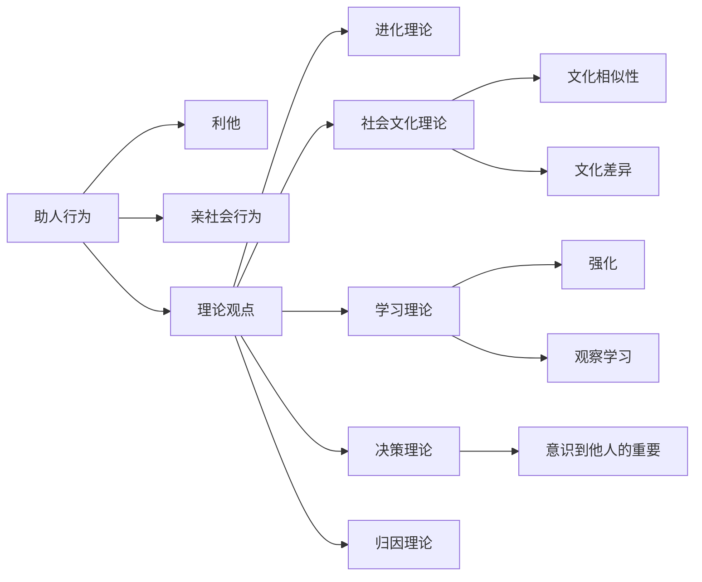

```mermaid
graph LR
助人行为 --> 利他
助人行为 --> 亲社会行为
助人行为 --> 理论观点
理论观点 --> 进化理论
理论观点 --> 社会文化理论
社会文化理论 --> 文化相似性
社会文化理论 --> 文化差异
理论观点 --> 学习理论
学习理论 --> 强化
学习理论 --> 观察学习
理论观点 --> 决策理论
决策理论 --> 意识到他人的重要
理论观点 --> 归因理论
```
